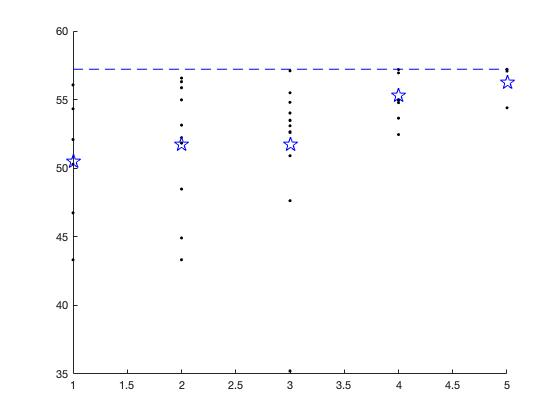
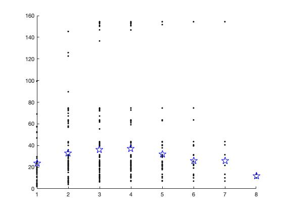
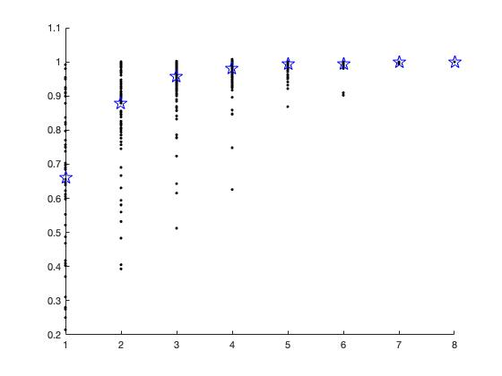

# [Recurrent_Voltage_collapse_in_complex_power_grids](https://github.com/hongshen-zhang/Voltage_collapse_in_complex_power_grids)

---

## Consider the condition of jump time and lambda of resilience 

The main result are 3 functions

----

## Function 1

- Run `consider_ond_point(case30,10)` where `case30` indicates the mpc data and `10` is the load bus index.

The black dashed line is the baseline that is the lambda without deletion.

----

## Funtion 2

- Run `consider_all_mpc(case30)` where `case30` indicates the mpc data.

Note that different points have various jump time(the maximum jump time of node `10` is 5 and the one of node `26` is 8). Thus the number various differently and doesn't have a uniform pattern. (This situation is mainly come from the huge difference of distribution of jump time.)

----

## Function 3

- Run `consider_all_mpc_uniform(case30)` where `case30` indicates the mpc data.

The result shown that more jump time would case less impact on lambda of the point.